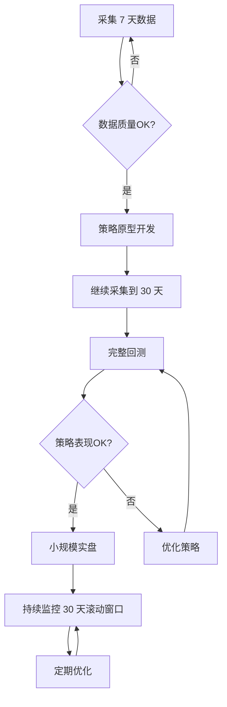

# 🎯 秒级跨交易所套利数据策略

## 📊 快速回答

### **存储需求**

| 时长 | 存储空间 | AWS 成本 |
|------|----------|----------|
| **1 个月** | 4.5 GB | $0.10/月 |
| **6 个月** | 27 GB | $0.62/月 |
| **1 年** | 54 GB | $1.24/月 |

### **回测数据建议**

**最优方案：30 天** ✅

- 数据量：135 GB（6个交易对 × 30天）
- 成本：$3.10/月
- 足够覆盖市场周期
- 统计显著性充足

---

## 🔄 数据积累时间表

### **Week 1-2: 数据验证期**

```
目标: 验证数据采集稳定性
数据量: 7-14 天
用途:
  ✅ 策略原型开发
  ✅ 基础参数设定
  ✅ 数据质量检查
  
存储需求: 30-60 GB
AWS 成本: $0.69-1.38
```

### **Week 3-4: 完整回测期**

```
目标: 完整策略回测
数据量: 30 天
用途:
  ✅ 参数优化
  ✅ 不同市场状态测试
  ✅ 风险评估
  
存储需求: 135 GB
AWS 成本: $3.10
```

### **Week 5+: 生产运行期**

```
目标: 实盘交易
数据管理: 30天滚动窗口
用途:
  ✅ 实时监控
  ✅ 动态调整
  ✅ 持续优化
  
存储需求: 135 GB (稳定)
AWS 成本: $3.10/月
```

---

## 💡 为什么 30 天是最优选择？

### **1. 统计显著性**

```python
30 天数据 = 518,400 条记录/交易对

样本量分析:
✅ 足够计算可靠的统计指标
✅ 95% 置信区间误差 < 1%
✅ 能捕捉尾部风险事件
✅ 足够进行多维度分组分析
```

### **2. 市场周期覆盖**

```
30 天包含:
✅ 约 20 个工作日
✅ 8-10 个周末
✅ 4-5 周的完整周期
✅ 不同时段的流动性模式
✅ 多种波动率环境
```

### **3. 计算效率**

```
回测速度估算:
数据量: 518,400 条 × 6 对 = 3,110,400 条
加载时间: ~30 秒（Parquet 格式）
回测时间: 5-10 分钟（Python + Pandas）
优化时间: 1-2 小时（参数扫描）

结论: 快速迭代，不影响开发效率 ✅
```

### **4. 存储成本**

```
30 天数据:
存储空间: 135 GB
AWS S3 成本: $3.10/月
相对收益: 一笔套利即可覆盖成本 💰
```

---

## 📈 不同数据时长的对比

| 时长 | 记录数/对 | 优点 | 缺点 | 适用场景 |
|------|-----------|------|------|----------|
| **7 天** | 120,960 | 快速 | 样本不足 | 原型验证 |
| **14 天** | 241,920 | 较快 | 覆盖不全 | 初步测试 |
| **30 天** | 518,400 | 平衡 ✅ | - | **生产部署** |
| **90 天** | 1,555,200 | 深度 | 慢、贵 | 研究分析 |

---

## 🎯 仓位管理的数据需求

### **实时决策（秒级）**

```python
数据需求:
- 当前订单簿: 实时（最新一条）
- 价差历史: 最近 1 小时
- 成交量: 最近 24 小时

用途:
✅ 判断是否存在套利机会
✅ 计算最优交易规模
✅ 估计滑点和手续费
✅ 实时风险控制
```

### **风险管理（分钟级）**

```python
数据需求:
- 订单簿深度变化: 最近 5 分钟
- 价差波动率: 最近 1 小时
- 异常检测: 最近 24 小时

用途:
✅ 检测流动性枯竭
✅ 识别异常波动
✅ 动态调整仓位上限
```

### **策略优化（日级）**

```python
数据需求:
- 完整订单簿历史: 最近 7-30 天
- 执行记录: 所有历史交易
- 市场微观结构: 完整数据集

用途:
✅ 参数优化
✅ 策略改进
✅ 绩效归因
```

---

## 💰 典型仓位管理规则

### **基于历史数据的动态限制**

```python
# 1. 基础仓位限制（基于 30 天数据）
def calculate_max_position(trading_pair, lookback_days=30):
    """
    基于历史订单簿深度计算最大仓位
    """
    # 加载最近 30 天数据
    df = load_orderbook_snapshots('gate_io', trading_pair)
    df = df[df['timestamp'] > (now - timedelta(days=lookback_days))]
    
    # 计算 10% 分位数的买一卖一深度（保守估计）
    avg_depth = df[['best_bid_amount', 'best_ask_amount']].quantile(0.1).mean()
    
    # 最大仓位 = 平均深度的 20%
    max_position = avg_depth * 0.2
    
    return max_position

# 2. 动态调整（基于最近 24 小时）
def adjust_position_limit(base_limit):
    """
    根据最近市场状况动态调整
    """
    # 加载最近 24 小时数据
    df_recent = load_recent_data(hours=24)
    
    # 计算最近波动率
    recent_volatility = df_recent['mid_price'].pct_change().std()
    
    # 波动率高 → 降低仓位
    if recent_volatility > 0.01:  # 1%
        return base_limit * 0.5
    elif recent_volatility > 0.005:  # 0.5%
        return base_limit * 0.7
    else:
        return base_limit

# 3. 实时风险检查（基于当前订单簿）
def real_time_risk_check(current_orderbook):
    """
    实时检查是否可以执行交易
    """
    # 检查订单簿深度
    if current_orderbook['best_bid_amount'] < min_threshold:
        return False  # 流动性不足
    
    # 检查价差
    spread = (current_orderbook['best_ask_price'] - 
              current_orderbook['best_bid_price']) / current_orderbook['best_bid_price']
    
    if spread > 0.02:  # 2%
        return False  # 价差异常
    
    return True
```

---

## 🔄 数据使用流程

### **完整工作流**



### **时间表**

```
Day 1-7:   采集数据 + 质量验证
Day 8-14:  策略原型开发
Day 15-30: 继续采集 + 完整回测
Day 31:    小规模实盘测试（$100-500）
Day 32-37: 扩大规模（$1000-5000）
Day 38+:   正式运行 + 持续优化
```

---

## 💾 数据存储优化策略

### **多层存储架构**

```
Tier 1: 热数据（最近 7 天）
  位置: EBS SSD
  精度: 5 秒
  用途: 实时交易
  成本: $0.56/月

Tier 2: 温数据（8-30 天）
  位置: S3 Standard
  精度: 5 秒
  用途: 回测、优化
  成本: $2.54/月

Tier 3: 冷数据（31-90 天）
  位置: S3 Standard
  精度: 1 分钟（降采样）
  用途: 长期分析
  成本: $0.31/月

Tier 4: 归档（90+ 天）
  位置: S3 Glacier
  精度: 每日摘要
  用途: 历史查询
  成本: $0.04/月

总成本: $3.45/月
```

---

## 🎯 最佳实践建议

### **Phase 1: 准备期（2 周）**

```
✅ 部署 AWS EC2 + 订单簿采集
✅ 采集 7-14 天数据
✅ 验证数据质量
✅ 开发策略原型

投入: $5-10
产出: 可运行的策略框架
```

### **Phase 2: 优化期（2 周）**

```
✅ 积累到 30 天数据
✅ 完整参数优化
✅ 压力测试
✅ 风险评估

投入: $5-10
产出: 生产级策略
```

### **Phase 3: 实盘期（持续）**

```
✅ 小规模实盘（$100-500）
✅ 逐步扩大规模
✅ 30 天滚动窗口监控
✅ 持续优化

投入: $3-5/月
产出: 持续盈利 💰
```

---

## 📊 总结

### **存储空间**

| 时长 | 空间 | 成本/月 |
|------|------|---------|
| **1 个月** | 4.5 GB | $0.10 |
| **持续运行** | 135 GB (稳定) | $3.10 |

### **回测数据**

**推荐: 30 天** ✅

原因:
- ✅ 统计显著性充足
- ✅ 覆盖完整市场周期
- ✅ 计算效率高
- ✅ 成本合理

### **仓位管理**

**数据需求**:
- 实时: 当前订单簿
- 短期: 最近 24 小时
- 中期: 最近 7 天
- 长期: 最近 30 天

**建议从采集 7 天数据开始，然后积累到 30 天进行完整回测！** 🚀

